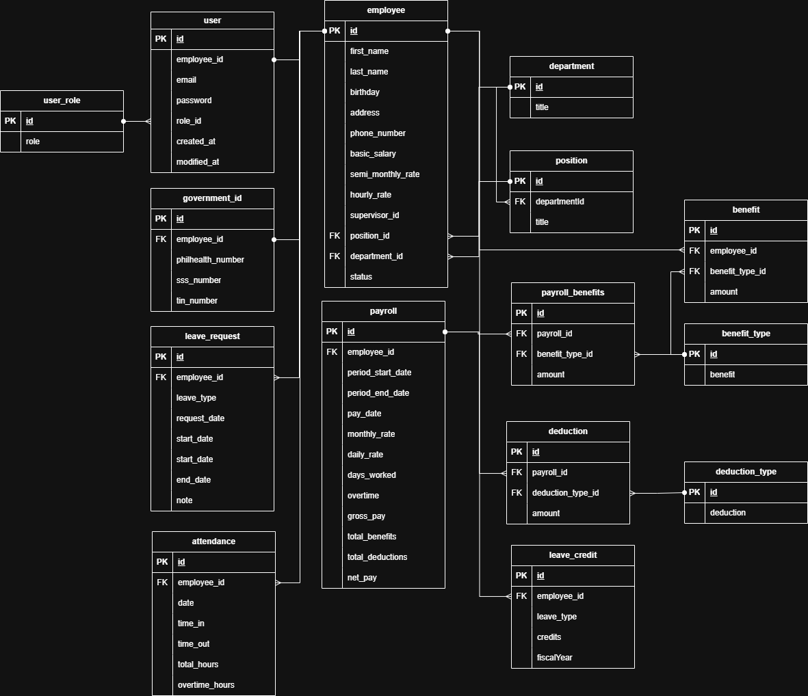

# Sweldox: HRIS 👥 RESTful API


## 🎯 Overview

Sweldox is a Human Resources Information System (HRIS) RESTful API that manages employee data, attendance tracking, leave management, and payroll processing. Built with Spring Boot 3.5.6 and Java 21, it features JWT authentication, role-based access control, and comprehensive API documentation with Swagger/OpenAPI.

## 🛠️ Technology Stack

- **Java 21** - Modern Java LTS with latest features
- **Spring Boot 3.5.6** - Enterprise application framework
- **Spring Data JPA** - Database ORM and abstraction
- **Spring Security + JWT** - Authentication & authorization
- **Spring Batch** - Bulk data processing
- **PostgreSQL** - Production database (AWS RDS)
- **Flyway** - Database migration management
- **Swagger/OpenAPI** - API documentation
- **Docker** - Containerization and deployment
- **GitHub Actions** - CI/CD pipeline
- **Maven** - Build and dependency management

## 🗄️ Database Entity-Relationship Diagram



## ✨ Key Features

### 1. Employee Management
- Complete CRUD operations for employee records
- Department and position assignment with supervisor hierarchies
- Government ID tracking (SSS, PhilHealth, TIN, Pag-IBIG)
- Compensation management (salary, allowances, benefits)
- Advanced filtering, pagination, and bulk CSV import

### 2. Attendance Tracking
- Clock in/out with automatic timestamp recording
- Attendance history with date range filtering
- Employee-specific and HR oversight capabilities
- Integration with payroll system

### 3. Leave Management
- **Leave Requests**: Create, track, and manage leave requests with multiple types (Vacation, Sick, Maternity, Paternity, Solo Parent, Bereavement)
- **Leave Credits**: Annual leave allocations with fiscal year tracking
- **Business Day Calculation**: Automatic exclusion of weekends
- **Approval Workflow**: PENDING → APPROVED/REJECTED status flow
- **CSV Import**: Bulk initialization of leave credits

### 4. Payroll Processing
- Automated payroll calculation based on attendance
- Philippine payroll standards compliance (SSS, PhilHealth, Pag-IBIG, Withholding Tax)
- Batch processing for all employees or individual generation
- Benefits and deductions management
- Period-based payroll reports with pagination

### 5. Security & Access Control
- JWT-based stateless authentication
- Role-based access control (HR, PAYROLL, IT, EMPLOYEE)
- Method-level security with BCrypt password hashing
- Secure API endpoints with authorization checks

### 6. User Management
- User account creation and role assignment
- Employee integration and bulk CSV import
- IT-role exclusive administration access

### Philippine Payroll System

The system implements Philippine payroll standards:

**Mandatory Deductions:**
- SSS (Social Security System) - Progressive contribution table
- PhilHealth - 3% premium rate (max ₱1,800)
- Pag-IBIG - 1-2% based on compensation (max ₱100)
- Withholding Tax - Progressive tax brackets (TRAIN Law)

**Net Pay Formula:**
```
Net Pay = Gross Pay + Benefits - (SSS + PhilHealth + Pag-IBIG + Tax)
```

## 🔐 User Roles & Permissions

- **HR** - Employee management, attendance oversight, leave approvals, organizational data
- **PAYROLL** - Payroll processing and generation
- **IT** - User management and system administration
- **EMPLOYEE** - Personal information, attendance, and payroll records

## 🚀 Getting Started

### Prerequisites
- Java 21 or higher
- Maven 3.8+
- Docker Desktop (includes Docker Compose)
- Git

### Environment Variables

Create a `.env` file in the root directory based on `.env.template`. Required variables:

```env
# Spring Profile Selection
SPRING_PROFILES_ACTIVE=local  # Use 'local' for development, 'prod' for production

# Server Configuration
PORT=8001

# Local Database Configuration (for local profile)
LOCAL_DB=sweldox
LOCAL_DB_HOST=localhost
LOCAL_DB_PORT=5432
LOCAL_DB_USER=postgres
LOCAL_DB_PASSWORD=your-password

# Cloud Database Configuration (for prod profile - AWS RDS)
CLOUD_DB=sweldox
CLOUD_DB_HOST=your-rds-endpoint.amazonaws.com
CLOUD_DB_PORT=5432
CLOUD_DB_USER=postgres
CLOUD_DB_PASSWORD=your-secure-password

# JWT Configuration
JWT_SECRET_KEY=your-secret-key-here-minimum-256-bits
JWT_EXPIRATION=86400000  # 24 hours in milliseconds
```

### Local Development Setup

> **Note**: For local development, use `compose.db.yml` to run PostgreSQL in Docker and run the API on your host machine for faster feedback and hot-reload capabilities.

1. **Clone the repository**
```powershell
git clone <repository-url>
cd sweldox
```

2. **Create .env file**
```powershell
# Copy the template file
Copy-Item .env.template .env

# Edit .env and fill in the required values, especially:
# - LOCAL_DB_PASSWORD
# - JWT_SECRET_KEY (minimum 256 bits for HS256)
# - JWT_EXPIRATION (e.g., 86400000 for 24 hours)
```

3. **Start the database with Docker Compose**
```powershell
docker compose --env-file .env -f compose.db.yml up -d
```

4. **Build the project**
```powershell
./mvnw clean install
```

5. **Run the application (local profile)**
```powershell
./mvnw spring-boot:run -Dspring-boot.run.profiles=local
```

The API will be available at `http://localhost:8001/api`.

### Running Tests
```powershell
./mvnw test
```

### Building for Production
```powershell
./mvnw clean package -DskipTests
```

The executable JAR will be generated in the `target/` directory.

## 🐳 Docker Support

The project includes Docker support for containerized deployment.

### Docker Compose Configurations

1. **`compose.db.yml`** - Database only (for local development)
   - Runs PostgreSQL container
   - Exposes port 5432

2. **`compose.yml`** - Full application stack (for production deployment)
   - Spring Boot API container (from GitHub Container Registry)
   - Connects to AWS RDS PostgreSQL
   - Watchtower for automatic container updates
   - Traefik reverse proxy integration

### Usage

**Build Docker Image:**
```powershell
docker build -t sweldox-api .
```

**Run Full Stack (Production):**
```powershell
docker compose --env-file .env up -d
```

**Run Database Only (Local Development):**
```powershell
docker compose --env-file .env -f compose.db.yml up -d
```

The Dockerfile uses a multi-stage build with Eclipse Temurin JDK 21 for compilation and JRE 21 for optimized deployment.

## 🧪 Testing

Comprehensive test coverage includes:

- **Unit Tests** - Service layer business logic
- **Test Coverage Areas**:
  - Employee Service
  - Attendance Service
  - Payroll Service
  - Leave Request Service
  - Leave Credit Service
  - User Service

Run tests with:
```powershell
./mvnw test
```

## 📚 API Documentation

The API documentation is available via Swagger/OpenAPI UI:

**Local Development:**
```
http://localhost:8001/swagger-ui/index.html
```

**OpenAPI JSON Spec:**
```
http://localhost:8001/v3/api-docs
```